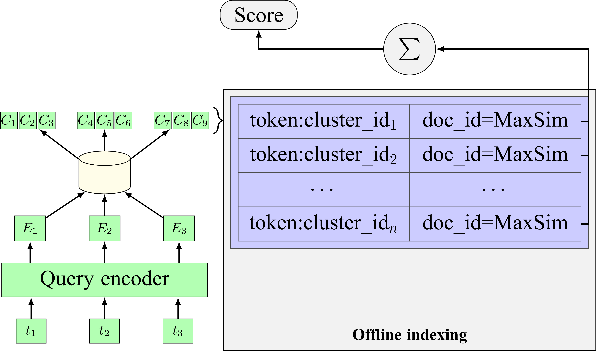
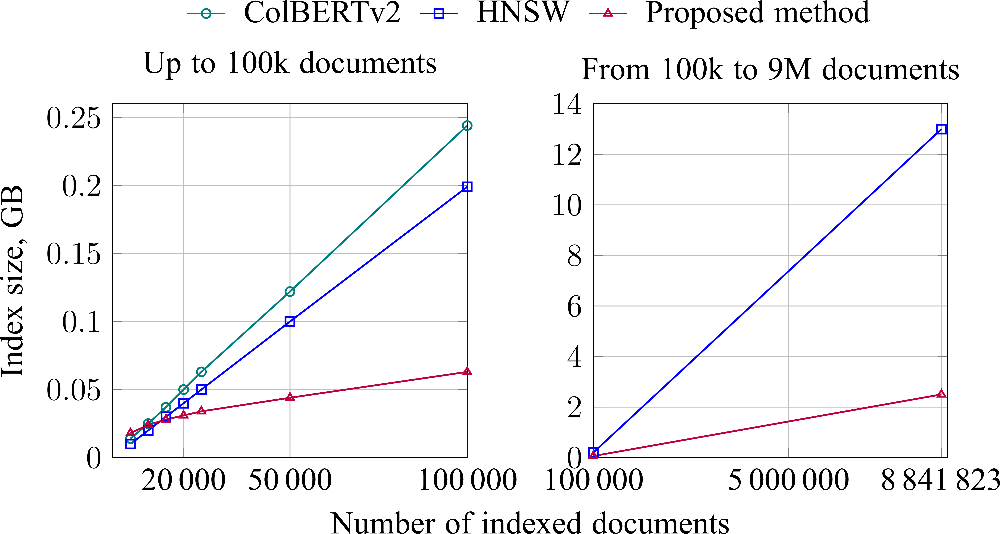

<p align="center">
  
</p>

# SparkBERT: Sparse representations using k-means and BERT

This repository contains a Rust implementation of the algorithm proposed in
[Efficient sparse retrieval through embedding-based inverted index construction](https://ntv.ifmo.ru/en/article/23315/effektivnyy_razrezhennyy_poisk_s_pomoschyu_postroeniya_invertirovannogo_indeksa_na_osnove_embeddingov%C2%A0.htm).

Naming:
> SparkBERT: **Spar**se representations using **k**-means and **BERT**

⚠️ Note: This is an early version of the project and the code is still a work in progress.

#### TL;DR

Vector search underpins many modern search engines thanks to its strong quality.
It is also widely used when building LLM agents for Retrieval-Augmented Generation (RAG).
The most commonly used algorithm for vector indexing is
Hierarchical Navigable Small World (HNSW) (see Table 3 in [this paper](https://arxiv.org/abs/2310.11703)).
Its main drawback is high memory consumption.
Moreover, Google DeepMind has shown that for a fixed vector dimensionality, beyond a certain number of documents
retrieving all relevant documents becomes mathematically impossible
(see [this paper](https://arxiv.org/abs/2508.21038)).

This work proposes a hybrid retrieval algorithm that combines the quality of deep neural networks such as BERT with the
resource efficiency of an inverted index.
To achieve this, it uses a so‑called vector vocabulary.
Its construction is based on the idea that each word can appear in different usage contexts, which can be captured in
the embedding of that word produced by BERT in a given context.
By collecting as many such context-aware embeddings as possible, we can cluster them and obtain a set of semantic
meanings for the word.
The centroids representing these semantic meanings become the elements of the vector vocabulary.

<p align="center">
  
</p>
<p align="center">
  <b>Figure 1:</b> Score calculation.
  <i>t</i><sub> i</sub> - token,
  <i>E</i><sub> i</sub> - embedding,
  <i>C</i><sub> i</sub> - centroid.
</p>

The resulting vector vocabulary is used both during indexing and during search.
It is important to note that for relevance scoring we use the MaxSim function proposed by the authors
of [ColBERT](https://github.com/stanford-futuredata/ColBERT),
which improves the quality of the scoring (see **Figure**).

As a result, the algorithm delivers search quality comparable to HNSW while requiring less memory.
In addition, because the index is built using vector vocabulary tokens (which effectively represent a sparse vector of
the document in the space of all vocabulary tokens) rather than relying on a single dense vector,
it addresses the problem described by the Google DeepMind team.
Moreover, the use of an inverted index significantly improves the scalability of semantic search.

## Usage

### Quick start

Since this algorithm uses [faiss-rs](https://github.com/Enet4/faiss-rs) bindings,
which require some additional installation steps,
the easiest way to run it is via Docker:

```shell
docker pull ghcr.io/viacheslav-dobrynin/spark-bert:latest
docker run -d -p 8000:8000 --name spark-bert -v $YOUR_PATH:/data/index ghcr.io/viacheslav-dobrynin/spark-bert:latest
```

You will need to wait a bit while the BERT model and vector vocabulary are downloaded from HuggingFace.

After that you can index documents:

```shell
curl -X POST http://localhost:8000/index \
    -H 'Content-Type: application/json' \
    -d '{
          "docs": [
            { "doc_id": 1, "text": "First document text" },
            { "doc_id": 2, "text": "Another document to index" }
          ]
        }'
```

And then search over them:

```shell
curl -X POST http://localhost:8000/search \
    -H "Content-Type: application/json" \
    -d '{
          "query": "text",
          "search_n_neighbors": 3,
          "top_k": 5
        }'
# fields search_n_neighbors and top_k are optional (defaults: 3 and 10)
```

### As Rust lib

Add spark-bert dependency:

```toml
[dependencies]
"spark-bert" = "*"
```

The current configuration automatically builds the required faiss version for faiss-rs from
source, but this requires additional dependencies listed in
[INSTALL.md](https://github.com/Enet4/faiss/blob/c_api_head/INSTALL.md#building-from-source).

## Original Implementation

The original implementation used in the paper was written in Python; see details in the following repository:
[source code](https://github.com/viacheslav-dobrynin/phd-ir-methods/tree/main/spar_k_means_bert).
It also describes the process of building the vector vocabulary.

The model used for both SparkBERT and HNSW is: `sentence-transformers/all-MiniLM-L6-v2`.

### Python+PyLucene Implementation Search Quality

For the MS MARCO dataset:

<p align="center">

| Algorithm                | NDCG@10 | MRR@10 |
|--------------------------|--------:|-------:|
| SparkBERT (Lucene based) |    0.25 |   0.20 |
| BM25 (Lucene based)      |    0.22 |   0.18 |
| HNSW (Lucene based)      |    0.17 |   0.13 |

</p>

For the SciFact dataset:

<p align="center">

| Algorithm                | NDCG@10 | MRR@10 |
|--------------------------|--------:|-------:|
| SparkBERT (Lucene based) |    0.63 |   0.60 |
| HNSW (Lucene based)      |    0.64 |   0.60 |
| ColBERTv2                |    0.69 |   0.66 |

</p>

### Python+PyLucene Implementation Memory Usage

Memory usage for the MS MARCO dataset:
<p align="center">
  
</p>
<p align="center">
  <b>Figure 2:</b> Comparison of algorithms by memory usage
</p>

## Current Rust Implementation Benchmarks
Coming soon 👀
